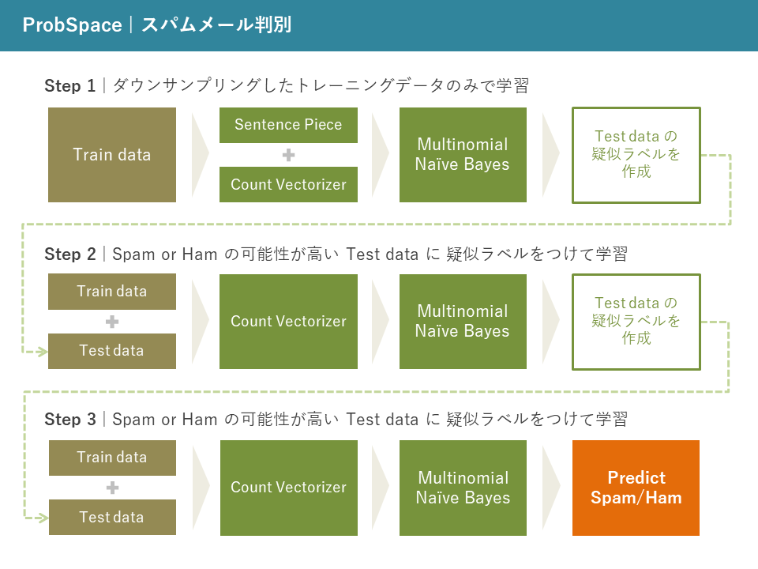

# スパムメール判別

https://prob.space/competitions/spam_mail

## 使用したノートブック
 * [probspace_spam_mail.ipynb](https://github.com/omegawvw/probspace_spam_mail/blob/main/probspace_spam_mail.ipynb)   
ノートブック内のDATA_DIRにtrain_data.csvとtest_data.csvがあるフォルダを指定してください

## 流れ

